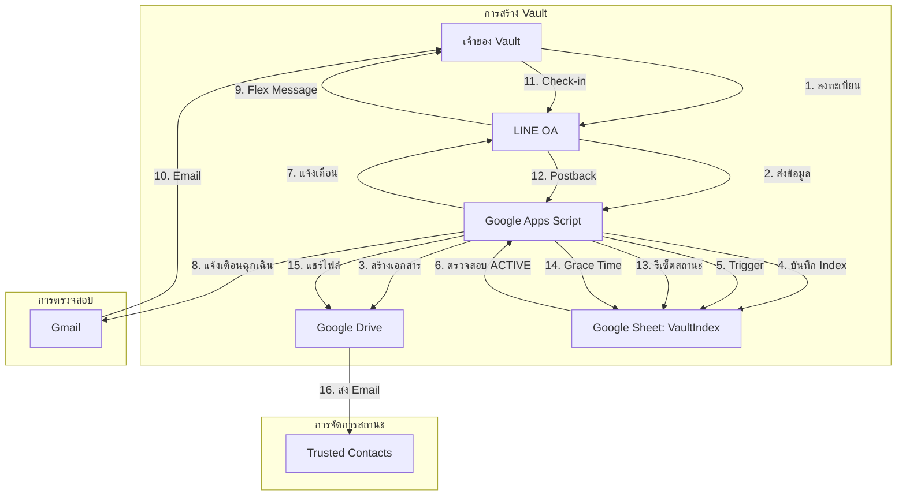

# Secret Keeper

ระบบ "สั่งเสีย" เปิดเผยความลับอัตโนมัติ (Automated Vault Revelation System)

## 📝 Overview

Secret Keeper คือระบบที่ทำงานร่วมกันระหว่าง Google Apps Script (GAS) และ LINE Official Account (OA) เพื่อจัดการ "Vault" (เอกสาร Google Docs และไฟล์แนบใน Google Drive) และจะทำการเปิดเผยข้อมูลเหล่านั้นให้กับผู้ติดต่อที่ไว้ใจโดยอัตโนมัติ หากเจ้าของ Vault ไม่สามารถเช็กอิน (Check-in) ได้ภายในกรอบเวลาที่กำหนด

## 📂 Project Structure

คลังเก็บโค้ดนี้ประกอบด้วย:

- `secret_keeper.js`: โค้ดหลักของ Google Apps Script ที่จัดการการสร้าง Vault, การตรวจสอบตามกำหนดเวลา, LINE Webhook และฟังก์ชัน Flex Message ต่างๆ
- `onboard.html`: ไฟล์ HTML สำหรับแบบฟอร์มง่ายๆ ที่ใช้ในหน้าเว็บแอป (Web App) เพื่อลงทะเบียน Vault ใหม่
- `index.js` และ `package.json`: โค้ด Node.js สำหรับใช้เป็น Proxy บน Google Cloud Functions หรือ Cloud Run (ทางเลือกเสริม)

## 👥 Target Audience

เอกสารนี้จัดทำขึ้นสำหรับนักพัฒนาหรือผู้ดูแลระบบที่ต้องการ:

- ติดตั้ง Google Apps Script ให้ทำงานเป็น Web App
- กำหนดค่า LINE Official Account (OA) และ Webhook
- จัดการระบบที่ต้องการการตรวจสอบ "การมีชีวิตอยู่" (Proof-of-Life) อย่างต่อเนื่อง

## ⚙️ Prerequisites

- บัญชี Google ที่สามารถเข้าถึง Google Drive, Google Sheets, Gmail และ Google Apps Script
- LINE Official Account และสิทธิ์เข้าถึง LINE Developers Console
- (ทางเลือก) Google Cloud Project ที่เปิดใช้งาน Billing Account สำหรับ Cloud Functions/Cloud Run

## 🗺️ System Diagram

ระบบ Secret Keeper มี Flow การทำงานหลัก 3 ขั้นตอน: การสร้าง, การตรวจสอบ, และการเปิดเผย

## 🛠️ Installation and Deployment Steps

### Google Apps Script

1. **Deploy โค้ด**

    - สร้างโปรเจกต์ Google Apps Script ใหม่.
    - คัดลอกเนื้อหาในไฟล์ `secret_keeper.js` และ `onboard.html` ไปวางในไฟล์โค้ดและไฟล์ HTML ใน Apps Script Editor ตามลำดับ.
    - Deploy โค้ดเป็น Web App โดยเลือกสิทธิ์การเข้าถึงเป็น "Anyone" และบันทึก URL ของ Web App ไว้ (เช่น `https://script.google.com/macros/s/DEPLOY_ID/exec`)

2. **ตั้งค่าตัวแปรใน Script Properties (สำคัญ)**

    ใน Apps Script Editor ไปที่ Project Settings (รูปเฟือง) > Script Properties เพื่อตั้งค่าตัวแปรดังต่อไปนี้:

    | Property Key | คำอธิบาย | ตัวอย่างค่า |
    |--------------|-------------|----------------|
    | LINE_CHANNEL_ACCESS_TOKEN | Token ที่ใช้สำหรับ Push Message และ Reply (จาก LINE Developers Console) | xxxxxxxxxxxxxxxx |
    | LINE_CHANNEL_SECRET | Secret Key สำหรับการยืนยัน Webhook | xxxxxxxxxxxxxxxx |
    | ADMIN_EMAIL | อีเมลแอดมิน (ใช้ในการส่งอีเมลความลับและรับแจ้งเตือน) | admin@example.com |
    | BASE_WEBAPP_URL | URL ของ Web App ที่ Deploy ไว้ในขั้นตอนที่ 1 | https://script.google.com/macros/s/DEPLOY_ID/exec |
    | EMAIL_SENDER_NAME | ชื่อผู้ส่งอีเมล (เช่น "Secret Keeper Bot") | Secret Keeper |
    | LINE_user_ID | User ID ของเจ้าของ LINE OA เพื่อจำกัดสิทธิ์การควบคุมบอท | Uxxxxxxxxxxxx |

3. **ตั้งค่า LINE OA Webhook**

    ใน LINE Developers Console ของ Channel ท่าน ไปที่เมนู Messaging API.

    - นำ URL ของ Web App ที่ได้จากขั้นตอนที่ 1 (หรือ URL Proxy จากขั้นตอนที่ 5) มาใส่ในช่อง Webhook URL.
    - ตรวจสอบให้แน่ใจว่า Use Webhook ถูกเปิดใช้งาน.

4. **ตั้งค่า Trigger (การตรวจสอบตามกำหนดเวลา)**

    ใน Apps Script Editor ไปที่เมนู Triggers (รูปนาฬิกา).

    - เพิ่ม Trigger ใหม่:
        - Choose which function to run: `scheduledCheck`
        - Select event source: Time-driven
        - Select type of time based trigger: Hour timer
        - Select hour interval: Every 12 hours (แนะนำ 12 ชั่วโมงเพื่อลด Grace Time Gap)

5. **(ทางเลือก) การใช้ Cloud Functions/Cloud Run เป็น Proxy สำหรับ Webhook (แนะนำ)**

    ถ้า LINE Webhook ส่ง Request มายัง Google Apps Script โดยตรงแล้วเกิดปัญหาความไม่เสถียร (เช่น Time out, HTTP 500 หรือ LINE ส่งซ้ำ), เราสามารถใช้ Google Cloud Functions (GCF) หรือ Cloud Run (Node.js Service) ทำหน้าที่เป็น Proxy เพื่อรับ Webhook จาก LINE และส่งต่อไปยัง GAS แทน ซึ่งจะช่วยรับประกันการตอบกลับสถานะ 200 OK กลับไปยัง LINE Platform ได้อย่างรวดเร็วและเสถียร

    ไฟล์ที่เกี่ยวข้อง:

    - `index.js`
    - `package.json`

    ขั้นตอน:

    - เตรียมไฟล์: สร้าง Folder ชื่อ `GCP-Proxy` (หรือชื่ออื่น) และใส่ไฟล์ `index.js` และ `package.json` ที่ให้ไว้ในส่วนถัดไปลงไป
    - ปรับค่า `GAS_WEBAPP_URL`: สำคัญ แก้ไขค่า `GAS_WEBAPP_URL` ในไฟล์ `index.js` ให้เป็น Execute URL ของ Google Apps Script ที่ท่าน Deploy ไว้ (จากขั้นตอน 1.3)
    - Deploy ไปยัง GCP:
        - สำหรับ Google Cloud Functions: สร้าง Function ใหม่ (เช่น `lineWebhookProxy`) โดยเลือก Runtime เป็น Node.js 20+ และกำหนด Entry point เป็น `lineWebhookProxy`
        - สำหรับ Cloud Run: สร้าง Service ใหม่ และ Deploy Source Code จาก Folder นี้
    - ใช้ URL Proxy: นำ URL Endpoint ที่ได้จาก Cloud Functions หรือ Cloud Run Service มาตั้งค่าในช่อง Webhook URL ใน LINE Developers Console (ขั้นตอน 3) แทน URL ของ GAS โดยตรง

## 📊 Data Structure

เมื่อรันโค้ดครั้งแรก ระบบจะสร้าง Google Sheet ชื่อ `VaultIndex` ขึ้นมาโดยอัตโนมัติ ซึ่งมี Header Row ตามลำดับดังนี้:

| Column | Header | Description |
|--------|---------|-------------|
| 0 | vaultId | ID เฉพาะของ Vault (VAULT-...) |
| 1 | ownerEmail | อีเมลของเจ้าของ Vault |
| 2 | ownerLineId | User ID ของ LINE เจ้าของ Vault |
| 3 | docId | ID ของ Google Doc ที่เก็บความลับ |
| 4 | docUrl | URL ของ Google Doc |
| 5 | filesFolderId | ID ของ Folder สำหรับไฟล์แนบ (ถ้ามี) |
| 6 | trustees | รายชื่ออีเมลผู้ติดต่อที่ไว้ใจ (คั่นด้วย comma) |
| 7 | checkinDays | กำหนดการเช็กอิน (หน่วย: วัน) |
| 8 | graceHours | ระยะเวลาผ่อนผัน (หน่วย: ชั่วโมง) |
| 9 | lastCheckinISO | วันที่/เวลาเช็กอินล่าสุด (ISO Format) |
| 10 | status | สถานะของ Vault (ACTIVE, REMINDER, ACTIVATED, DEACTIVATED) |
| 11 | createdAt | วันที่สร้าง Vault |
| 12 | lastReminderISO | วันที่/เวลาที่ส่งการแจ้งเตือนฉุกเฉินครั้งล่าสุด (ISO Format) |

## 💬 LINE Commands

ระบบสามารถตอบสนองต่อข้อความและ Postback Action ดังนี้:

| Command | Type | Description |
|---------|------|-------------|
| `register` | Text | เริ่มต้นกระบวนการสร้าง Vault |
| `checkin` | Postback | ยืนยันตัวตนและรีเซ็ตเวลา |
| `deactivate` | Text | หยุดการตรวจสอบ Vault |
| `list` | Text | แสดงรายการ Vault ทั้งหมด |
| `help` | Text | แสดงเมนูช่วยเหลือ |

## 📧 Emergency Notifications (Dual-Channel Reminder)

เมื่อ Vault พ้นกำหนด `checkinDays` ระบบจะเข้าสู่ช่วง `graceHours` (ระยะเวลาผ่อนผัน) ในช่วงนี้ ระบบจะทำการแจ้งเตือนฉุกเฉินดังนี้:

- **LINE Reminder**: ส่ง Flex Message ที่มีปุ่ม Check-in
- **Email Reminder**: ส่งอีเมลแจ้งเตือนพร้อมลิงก์ Check-in ฉุกเฉิน

การดำเนินการนี้เป็นการ "ส่งคู่ขนาน" เพื่อให้มั่นใจว่าเจ้าของ Vault จะได้รับการแจ้งเตือนและลิงก์ Check-in อย่างแน่นอน แม้ช่องทาง LINE จะขัดข้องหรือมีปัญหาชั่วคราวก็ตาม