# Secret Keeper

ระบบ "สั่งเสีย" เปิดเผยความลับอัตโนมัติ (Automated Vault Revelation System)

## 📝 Overview

Secret Keeper คือระบบที่ทำงานร่วมกันระหว่าง Google Apps Script (GAS) และ LINE Official Account (OA) เพื่อจัดการ "Vault" (เอกสาร Google Docs และไฟล์แนบใน Google Drive) และจะทำการเปิดเผยข้อมูลเหล่านั้นให้กับผู้ติดต่อที่ไว้ใจโดยอัตโนมัติ หากเจ้าของ Vault ไม่สามารถเช็กอิน (Check-in) ได้ภายในกรอบเวลาที่กำหนด

## 📂 Project Structure

คลังเก็บโค้ดนี้ประกอบด้วย:

- `secret_keeper.js`: โค้ดหลักของ Google Apps Script ที่จัดการการสร้าง Vault, การตรวจสอบตามกำหนดเวลา, LINE Webhook และฟังก์ชัน Flex Message ต่างๆ
- `onboard.html`: ไฟล์ HTML สำหรับแบบฟอร์มง่ายๆ ที่ใช้ในหน้าเว็บแอป (Web App) เพื่อลงทะเบียน Vault ใหม่
- `index.js` และ `package.json`: โค้ด Node.js สำหรับใช้เป็น Proxy บน Google Cloud Functions หรือ Cloud Run (ทางเลือกเสริม)

## 👥 Target Audience

เอกสารนี้จัดทำขึ้นสำหรับนักพัฒนาหรือผู้ดูแลระบบที่ต้องการ:

- ติดตั้ง Google Apps Script ให้ทำงานเป็น Web App
- กำหนดค่า LINE Official Account (OA) และ Webhook
- จัดการระบบที่ต้องการการตรวจสอบ "การมีชีวิตอยู่" (Proof-of-Life) อย่างต่อเนื่อง

## ⚙️ Prerequisites

- บัญชี Google ที่สามารถเข้าถึง Google Drive, Google Sheets, Gmail และ Google Apps Script
- LINE Official Account และสิทธิ์เข้าถึง LINE Developers Console
- (ทางเลือก) Google Cloud Project ที่เปิดใช้งาน Billing Account สำหรับ Cloud Functions/Cloud Run

## 🗺️ System Diagram

ระบบ Secret Keeper มี Flow การทำงานหลัก 3 ขั้นตอน: การสร้าง, การตรวจสอบ, และการเปิดเผย

```mermaid
flowchart TD
    Start([User เริ่มใช้งาน]) --> Register[User ส่งคำสั่ง 'register' ผ่าน LINE]
    Register --> CheckActive{มี Vault<br/>ACTIVE อยู่แล้ว?}
    
    CheckActive -->|ใช่| ShowActive[แสดง Flex Message:<br/>คุณมี Vault อยู่แล้ว]
    CheckActive -->|ไม่| OpenWeb[เปิดหน้าเว็บ<br/>กรอกข้อมูล Vault]
    
    ShowActive --> End1([จบ])
    
    OpenWeb --> FillForm[กรอกข้อมูล:<br/>- ชื่อ Vault<br/>- เนื้อหาลับ<br/>- Trusted Contacts<br/>- Check-in Days<br/>- Grace Hours<br/>- ไฟล์แนบ]
    
    FillForm --> CreateVault[สร้าง Vault<br/>Status: ACTIVE<br/>บันทึก lastCheckinISO]
    
    CreateVault --> DailyCheck[ระบบตรวจสอบอัตโนมัติ<br/>ทุก ๆ 24 ชม.]
    
    DailyCheck --> CalcTime[คำนวณเวลา:<br/>ตอนนี้ - lastCheckin]
    
    CalcTime --> CheckOverdue{เกิน<br/>checkinDays?}
    
    CheckOverdue -->|ไม่เกิน| WaitNext[รอตรวจสอบรอบถัดไป<br/>24 ชม.]
    WaitNext --> DailyCheck
    
    CheckOverdue -->|เกิน| CheckGrace{เกิน<br/>Grace Hours?}
    
    CheckGrace -->|ยังไม่เกิน| CheckReminder{ส่ง Reminder<br/>ไปแล้วหรือยัง<br/>ใน 24 ชม.?}
    
    CheckReminder -->|ยังไม่ส่ง| SendReminder[ส่ง Reminder:<br/>1. LINE Flex Message<br/>2. Email พร้อมลิงก์ Check-in]
    CheckReminder -->|ส่งแล้ว| WaitNext
    
    SendReminder --> UpdateReminder[บันทึก lastReminderISO]
    UpdateReminder --> UserResponse{User ตอบกลับ?}
    
    UserResponse -->|ตอบ 'checkin'| UpdateCheckin[อัปเดต lastCheckinISO<br/>เคลียร์ lastReminderISO]
    UpdateCheckin --> DailyCheck
    
    UserResponse -->|ไม่ตอบ| WaitGrace[รอจนครบ<br/>Grace Hours]
    WaitGrace --> DailyCheck
    
    CheckGrace -->|เกิน Grace| ActivateVault[🚨 ACTIVATE VAULT<br/>Status: ACTIVATED]
    
    ActivateVault --> ShareDoc[แชร์เอกสาร Google Doc<br/>ให้ Trustees]
    ShareDoc --> ShareFiles{มีไฟล์แนบ?}
    
    ShareFiles -->|มี| ShareFolder[แชร์ Folder/File<br/>ให้ Trustees]
    ShareFiles -->|ไม่มี| SendEmail
    
    ShareFolder --> SendEmail[ส่ง Email ถึง Trustees<br/>พร้อมลิงก์เอกสารและไฟล์]
    
    SendEmail --> End2([จบ: Vault ถูกเปิดใช้งาน])
    
    style Start fill:#e1f5e1
    style Register fill:#bbdefb
    style CreateVault fill:#c8e6c9
    style DailyCheck fill:#fff9c4
    style SendReminder fill:#ffccbc
    style ActivateVault fill:#ef5350,color:#fff
    style ShareDoc fill:#ef9a9a
    style SendEmail fill:#ef9a9a
    style End2 fill:#ffcdd2
    style UpdateCheckin fill:#a5d6a7
```



## 🛠️ Installation and Deployment Steps

### Google Apps Script

1. **Deploy โค้ด**

    - สร้างโปรเจกต์ Google Apps Script ใหม่.
    - คัดลอกเนื้อหาในไฟล์ `secret_keeper.js` และ `onboard.html` ไปวางในไฟล์โค้ดและไฟล์ HTML ใน Apps Script Editor ตามลำดับ.
    - Deploy โค้ดเป็น Web App โดยเลือกสิทธิ์การเข้าถึงเป็น "Anyone" และบันทึก URL ของ Web App ไว้ (เช่น `https://script.google.com/macros/s/DEPLOY_ID/exec`)

2. **ตั้งค่าตัวแปรใน Script Properties (สำคัญ)**

    ใน Apps Script Editor ไปที่ Project Settings (รูปเฟือง) > Script Properties เพื่อตั้งค่าตัวแปรดังต่อไปนี้:

    | Property Key | คำอธิบาย | ตัวอย่างค่า |
    |--------------|-------------|----------------|
    | LINE_CHANNEL_ACCESS_TOKEN | Token ที่ใช้สำหรับ Push Message และ Reply (จาก LINE Developers Console) | xxxxxxxxxxxxxxxx |
    | LINE_CHANNEL_SECRET | Secret Key สำหรับการยืนยัน Webhook | xxxxxxxxxxxxxxxx |
    | ADMIN_EMAIL | อีเมลแอดมิน (ใช้ในการส่งอีเมลความลับและรับแจ้งเตือน) | admin@example.com |
    | BASE_WEBAPP_URL | URL ของ Web App ที่ Deploy ไว้ในขั้นตอนที่ 1 | https://script.google.com/macros/s/DEPLOY_ID/exec |
    | EMAIL_SENDER_NAME | ชื่อผู้ส่งอีเมล (เช่น "Secret Keeper Bot") | Secret Keeper |
    | LINE_user_ID | User ID ของเจ้าของ LINE OA เพื่อจำกัดสิทธิ์การควบคุมบอท | Uxxxxxxxxxxxx |

3. **ตั้งค่า LINE OA Webhook**

    ใน LINE Developers Console ของ Channel ท่าน ไปที่เมนู Messaging API.

    - นำ URL ของ Web App ที่ได้จากขั้นตอนที่ 1 (หรือ URL Proxy จากขั้นตอนที่ 5) มาใส่ในช่อง Webhook URL.
    - ตรวจสอบให้แน่ใจว่า Use Webhook ถูกเปิดใช้งาน.

4. **ตั้งค่า Trigger (การตรวจสอบตามกำหนดเวลา)**

    ใน Apps Script Editor ไปที่เมนู Triggers (รูปนาฬิกา).

    - เพิ่ม Trigger ใหม่:
        - Choose which function to run: `scheduledCheck`
        - Select event source: Time-driven
        - Select type of time based trigger: Hour timer
        - Select hour interval: Every 12 hours (แนะนำ 12 ชั่วโมงเพื่อลด Grace Time Gap)

5. **(ทางเลือก) การใช้ Cloud Functions/Cloud Run เป็น Proxy สำหรับ Webhook (แนะนำ)**

    ถ้า LINE Webhook ส่ง Request มายัง Google Apps Script โดยตรงแล้วเกิดปัญหาความไม่เสถียร (เช่น Time out, HTTP 500 หรือ LINE ส่งซ้ำ), เราสามารถใช้ Google Cloud Functions (GCF) หรือ Cloud Run (Node.js Service) ทำหน้าที่เป็น Proxy เพื่อรับ Webhook จาก LINE และส่งต่อไปยัง GAS แทน ซึ่งจะช่วยรับประกันการตอบกลับสถานะ 200 OK กลับไปยัง LINE Platform ได้อย่างรวดเร็วและเสถียร

    ไฟล์ที่เกี่ยวข้อง:

    - `index.js`
    - `package.json`

    ขั้นตอน:

    - เตรียมไฟล์: สร้าง Folder ชื่อ `GCP-Proxy` (หรือชื่ออื่น) และใส่ไฟล์ `index.js` และ `package.json` ที่ให้ไว้ในส่วนถัดไปลงไป
    - ปรับค่า `GAS_WEBAPP_URL`: สำคัญ แก้ไขค่า `GAS_WEBAPP_URL` ในไฟล์ `index.js` ให้เป็น Execute URL ของ Google Apps Script ที่ท่าน Deploy ไว้ (จากขั้นตอน 1.3)
    - Deploy ไปยัง GCP:
        - สำหรับ Google Cloud Functions: สร้าง Function ใหม่ (เช่น `lineWebhookProxy`) โดยเลือก Runtime เป็น Node.js 20+ และกำหนด Entry point เป็น `lineWebhookProxy`
        - สำหรับ Cloud Run: สร้าง Service ใหม่ และ Deploy Source Code จาก Folder นี้
    - ใช้ URL Proxy: นำ URL Endpoint ที่ได้จาก Cloud Functions หรือ Cloud Run Service มาตั้งค่าในช่อง Webhook URL ใน LINE Developers Console (ขั้นตอน 3) แทน URL ของ GAS โดยตรง

## 📊 Data Structure

เมื่อรันโค้ดครั้งแรก ระบบจะสร้าง Google Sheet ชื่อ `VaultIndex` ขึ้นมาโดยอัตโนมัติ ซึ่งมี Header Row ตามลำดับดังนี้:

| Column | Header | Description |
|--------|---------|-------------|
| 0 | vaultId | ID เฉพาะของ Vault (VAULT-...) |
| 1 | ownerEmail | อีเมลของเจ้าของ Vault |
| 2 | ownerLineId | User ID ของ LINE เจ้าของ Vault |
| 3 | docId | ID ของ Google Doc ที่เก็บความลับ |
| 4 | docUrl | URL ของ Google Doc |
| 5 | filesFolderId | ID ของ Folder สำหรับไฟล์แนบ (ถ้ามี) |
| 6 | trustees | รายชื่ออีเมลผู้ติดต่อที่ไว้ใจ (คั่นด้วย comma) |
| 7 | checkinDays | กำหนดการเช็กอิน (หน่วย: วัน) |
| 8 | graceHours | ระยะเวลาผ่อนผัน (หน่วย: ชั่วโมง) |
| 9 | lastCheckinISO | วันที่/เวลาเช็กอินล่าสุด (ISO Format) |
| 10 | status | สถานะของ Vault (ACTIVE, REMINDER, ACTIVATED, DEACTIVATED) |
| 11 | createdAt | วันที่สร้าง Vault |
| 12 | lastReminderISO | วันที่/เวลาที่ส่งการแจ้งเตือนฉุกเฉินครั้งล่าสุด (ISO Format) |
| 13 | activatedNotified | (ใหม่) Timestamp เมื่อเจ้าของได้รับแจ้งเตือนหลัง Vault ถูก ACTIVATED (ใช้เพื่อป้องกันการแจ้งซ้ำ)

### การย้ายข้อมูล (Migration) — ถ้า Sheet เก่ามีอยู่แล้ว
- หากคุณมีไฟล์ VaultIndex เดิมที่สร้างก่อนฟีเจอร์นี้ ให้เพิ่มคอลัมน์ใหม่ชื่อ `activatedNotified` เป็นคอลัมน์สุดท้าย (หรือเพิ่มคอลัมน์ที่ตำแหน่ง 14 ของ Sheet)
- ค่าเริ่มต้นควรเว้นว่างไว้ (empty) — ระบบจะถือว่า vault ยังไม่ได้แจ้งเจ้าของจนกว่าจะมีค่า timestamp ถูกเขียนเข้าไป
- ตัวอย่างสูตรง่ายๆ ใน Google Sheets (เพื่อเติมค่าว่างเป็น ''): วางในคอลัมน์ใหม่แล้วคัดลอก/วางค่าเป็นค่า (Paste values) เพื่อให้ Apps Script อ่านได้ปกติ

## 💬 LINE Commands

ระบบสามารถตอบสนองต่อข้อความและ Postback Action ดังนี้:

| Command | Type | Description |
|---------|------|-------------|
| `register` | Text | เริ่มต้นกระบวนการสร้าง Vault |
| `checkin` | Postback | ยืนยันตัวตนและรีเซ็ตเวลา |
| `deactivate` | Text | หยุดการตรวจสอบ Vault |
| `list` | Text | แสดงรายการ Vault ทั้งหมด |
| `help` | Text | แสดงเมนูช่วยเหลือ |

## 📧 การแจ้งเตือนเมื่อ Vault ถูก "ACTIVATED" (ฟีเจอร์ใหม่)
เมื่อ Vault พ้นช่วง Grace Time และระบบเปลี่ยนสถานะเป็น ACTIVATED ระบบจะ:
1. แชร์ Google Doc และไฟล์แนบกับผู้ติดต่อที่ไว้ใจ (Trustees)
2. ส่งอีเมลไปยัง Trustees (เหมือนเดิม)
3. ส่งแจ้งเตือนถึงเจ้าของ Vault ทั้งทาง Email และ LINE แต่จะส่งเพียงครั้งเดียวต่อ Vault เดียว — เพื่อป้องกันสแปม หากระบบรันซ้ำจะไม่ส่งซ้ําเพราะค่าคอลัมน์ `activatedNotified` จะถูกบันทึกเป็น timestamp เมื่อส่งแล้ว

สิ่งที่ README อธิบายเพิ่มเติม:
- ต้องมี Script Property `EMAIL_SENDER_NAME` (ชื่อผู้ส่ง) เพื่อให้ GmailApp ส่งอีเมลโดยระบุชื่อผู้ส่ง (ค่าจะถูกใช้ทั้งแจ้ง Trustees และแจ้งเจ้าของ)
- เมื่อต้องการรีเซ็ตการแจ้งเตือนสำหรับ Vault ใด ให้ลบค่า `activatedNotified` ในแถวของ Vault นั้นเพื่อให้ระบบสามารถส่งซ้ำได้ (ถ้าจำเป็น)

ตัวอย่างข้อความที่ระบบส่ง (ภาษาไทย)

- Email (Subject)
  ```
  🚨 ALERT: Vault ID ${vaultId} ถูกเปิดเผยแล้ว (Activated)
  ```

- Email (Body) — ตัวอย่าง
  ```
  เรียน เจ้าของ Vault (${ownerEmail})

  เอกสารความลับของคุณได้ถูก **เปิดเผย (Activated)** และแชร์ไปยังผู้ติดต่อที่ไว้ใจของคุณเรียบร้อยแล้ว เนื่องจากคุณไม่ได้ทำการ Check-in ภายในระยะเวลาที่กำหนด (${checkinDays} วัน + ${graceHours} ชั่วโมง)

  --- ข้อมูล Vault ---
  Vault ID: ${vaultId}
  สถานะ: ACTIVATED
  ลิงก์ Google Doc: ${docUrl}
  ลิงก์ Folder ไฟล์แนบ: https://drive.google.com/drive/folders/${filesFolderId}

  หากการเปิดเผยนี้เกิดจากความผิดพลาด/ไม่ได้ตั้งใจ: **อย่าตื่นตระหนก!** คุณยังมีโอกาสแก้ไขได้

  1. เข้าไปยังลิงก์ Google Doc และ Folder ไฟล์แนบด้านบนทันที
  2. ทำการ **ยกเลิกการแชร์ (Stop sharing)** สำหรับเอกสารและ Folder ไฟล์แนบทั้งหมด
  3. หากทำได้ทันเวลา ผู้รับเอกสารดังกล่าวอาจจะยังไม่ได้เปิดอ่านข้อความของคุณ ความลับของคุณ "อาจจะ" ยังไม่ถูกอ่านแม้จะได้รับอีเมลแล้วก็ตาม
  ```

- LINE (ข้อความสั้น)
  ```
  🚨 ALERT: Vault ID ${vaultId} ถูกเปิดเผยแล้ว! เอกสารถูกแชร์ไปยังผู้ติดต่อที่ไว้ใจ

  ❌ หากผิดพลาด: โปรดเข้า Drive และ **ยกเลิกการแชร์ทันที!** (ตรวจสอบ Email สำหรับคำแนะนำฉบับเต็ม)
  ```

## การตั้งค่า Script Properties ที่เกี่ยวข้อง (เตือนอีกครั้ง)
- LINE_CHANNEL_ACCESS_TOKEN
- LINE_CHANNEL_SECRET
- ADMIN_EMAIL
- BASE_WEBAPP_URL
- EMAIL_SENDER_NAME ← สำคัญ: ชื่อที่จะแสดงเป็นผู้ส่งในอีเมลแจ้งเตือน (Trustees & Owner)
- LINE_user_ID
